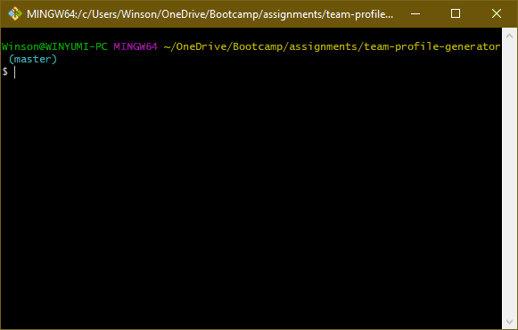
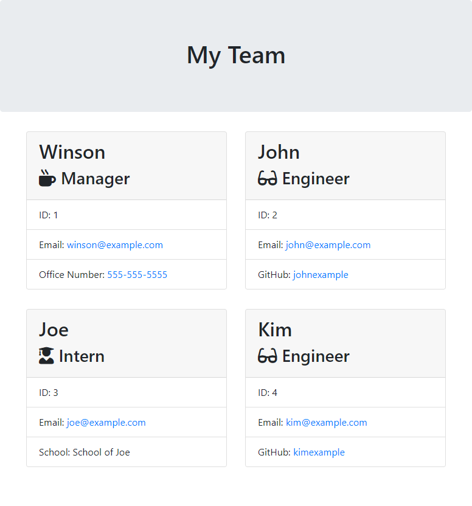

# Team Profile Generator

## Introduction

Do you need to create a web page that lists the people in your team? Use this command-line application to generate an HTML file that's ready to use for your website!

## Installation

**Node.js v13+** is required in order to run this script.

1. Download or clone this repository into your local computer.
2. In your terminal, browse to the folder and run `npm install --production`.

## Usage

1. In your terminal, run the script with the command `node app.js`.
2. Enter your manager details when prompted.
3. Add additional members by selecting a role.
4. After all members have been added, your HTML will be generated in the `output/` folder.

## Example

